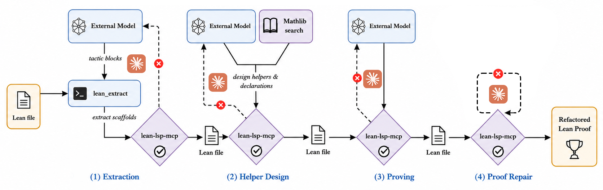

# Proof-Refactor

Proof-Refactor is an agentic proof refactoring framework for Lean 4.

Paper: [arXiv:2606.03743](https://arxiv.org/abs/2606.03743)

Website: [https://pelicanhere.github.io/proof-refactor-site/](https://pelicanhere.github.io/proof-refactor-site/)

Docs: [Usage](USAGE.md) · [Config](config/README.md) · [Lean workspace](Lean/README.md) · [Evaluation](evaluation/README.md)

## Pipeline



| Phase | Purpose |
|---|---|
| Extraction | identify local proof blocks and extract temporary scaffolds |
| Design | design reusable helper declarations |
| Proving | prove scaffold/helper objects in the work file |
| Repair | repair the final proof guided by the scaffolds |

## Quick Test

Fresh checkout:

```bash
git submodule update --init --recursive
uv sync
bash configure.sh --workspace Lean --variant light
```

Minimal `.env`:

```text
GEMINI_API_KEY=your_key
BASE_URL=https://your-openai-compatible-endpoint/v1
MODEL=gemini-3.1-pro-preview
LEAN_REPL=true
```

Smoke demo (Codex CLI backend):

```bash
uv run proof-refactor run dataset/repeat_test.lean
```

Proof-Refactor supports both Codex CLI and the legacy Claude Code runner:

| Backend | How to use |
|---|---|
| Codex CLI | default for `run`, `phase`, and `batch`; pass `--agent codex` explicitly if needed |
| Claude Code | pass `--agent claude` to use the legacy backend |

The default `light` prompt variant is the no-plan mode used in the paper. The
optional `plan` variant keeps a separate `refactor_plan.md`, which may help on
longer Lean files but uses substantially more tokens.

`dataset/repeat_test.lean` resolves to `Lean/dataset/repeat_test.lean` with the
default config. Output is written to:

```text
Lean/output/phase/repeat_test[_n]/
```

See [USAGE.md](USAGE.md) for the full setup checklist, phase reruns, batch runs,
and output layout details.

Proof-Refactor invokes Codex with bypassed approvals/sandbox by default, matching
the previous Claude Code `bypassPermissions` behavior. Run it only in a trusted
workspace.

## Repository Layout

```text
Proof-Refactor/
├── src/proof_refactor/      # Python package and CLI
├── config/                  # YAML config
├── evaluation/              # scoring scripts
├── Lean/                    # Lean workspace
├── lean-lsp-mcp/            # MCP submodule
├── assets/                  # figures
└── configure.sh
```

## Acknowledgements

Proof-Refactor takes inspiration from
[Numina-Lean-Agent](https://github.com/project-numina/numina-lean-agent) and
uses a modified version of
[lean-lsp-mcp](https://github.com/oOo0oOo/lean-lsp-mcp).
The baseline comparisons use
[lean4-skills](https://github.com/semorrison/lean4-skills).
